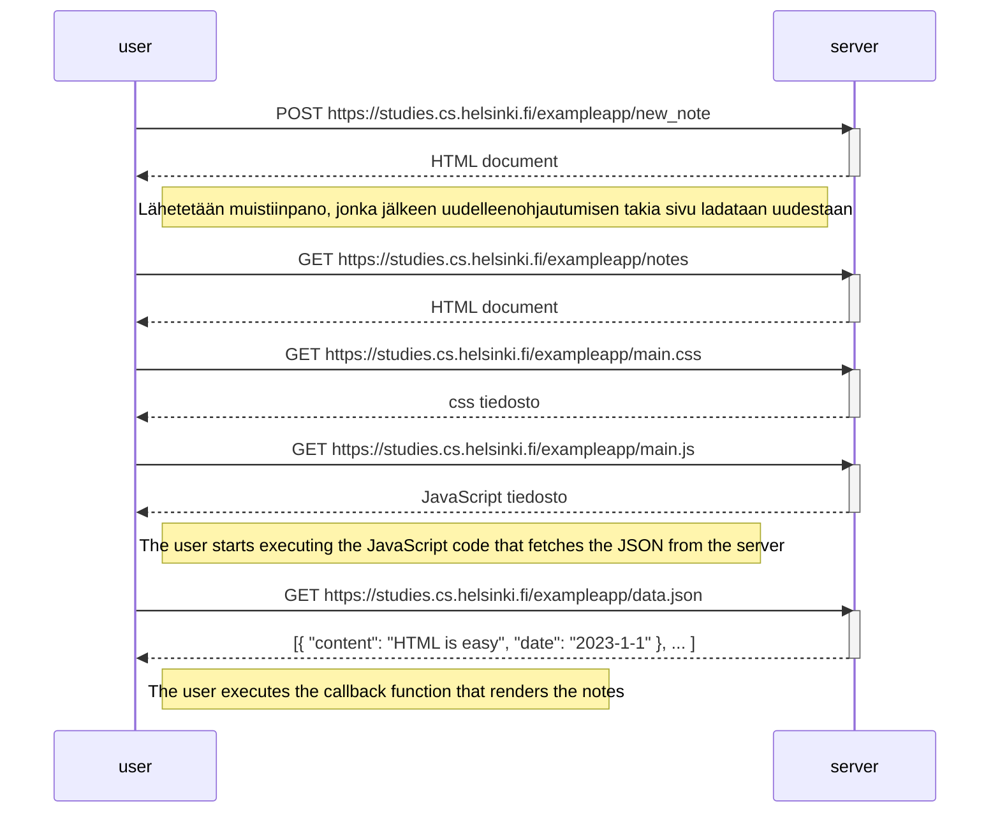

Käyttäjä luo uuden muistiinpanon sivulla https://studies.cs.helsinki.fi/exampleapp/notes 

```mermaid
sequenceDiagram
    participant user
    participant server
    
    user->>server: POST https://studies.cs.helsinki.fi/exampleapp/new_note
    activate server
    server-->>user: HTML document
    deactivate server

    Note right of user: Lähetetään muistiinpano, jonka jälkeen uudelleenohjautumisen takia sivu ladataan uudestaan
    
    user->>server: GET https://studies.cs.helsinki.fi/exampleapp/notes
    activate server
    server-->>user: HTML document
    deactivate server
    
    user->>server: GET https://studies.cs.helsinki.fi/exampleapp/main.css
    activate server
    server-->>user: css tiedosto
    deactivate server
    
    user->>server: GET https://studies.cs.helsinki.fi/exampleapp/main.js
    activate server
    server-->>user: JavaScript tiedosto
    deactivate server
    
    Note right of user: The user starts executing the JavaScript code that fetches the JSON from the server
    
    user->>server: GET https://studies.cs.helsinki.fi/exampleapp/data.json
    activate server
    server-->>user: [{ "content": "HTML is easy", "date": "2023-1-1" }, ... ]
    deactivate server    

    Note right of user: The user executes the callback function that renders the notes 
```