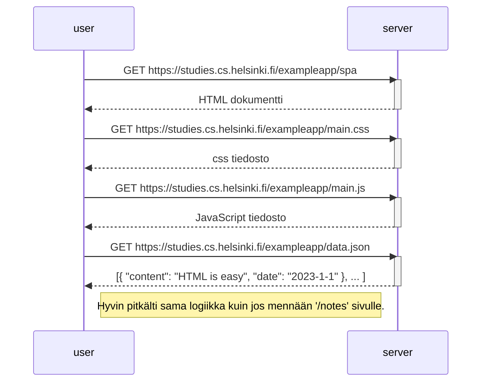

Käyttäjä menee selaimella osoitteeseen https://studies.cs.helsinki.fi/exampleapp/spa

```mermaid
sequenceDiagram
    participant user
    participant server
    
    user->>server: GET https://studies.cs.helsinki.fi/exampleapp/spa
    activate server
    server-->>user: HTML dokumentti
    deactivate server
    
    user->>server: GET https://studies.cs.helsinki.fi/exampleapp/main.css
    activate server
    server-->>user: css tiedosto
    deactivate server
    
    user->>server: GET https://studies.cs.helsinki.fi/exampleapp/main.js
    activate server
    server-->>user: JavaScript tiedosto
    deactivate server
    
    user->>server: GET https://studies.cs.helsinki.fi/exampleapp/data.json
    activate server
    server-->>user: [{ "content": "HTML is easy", "date": "2023-1-1" }, ... ]
    deactivate server  

    Note right of user: Hyvin pitkälti sama logiikka kuin jos mennään '/notes' sivulle.  
```